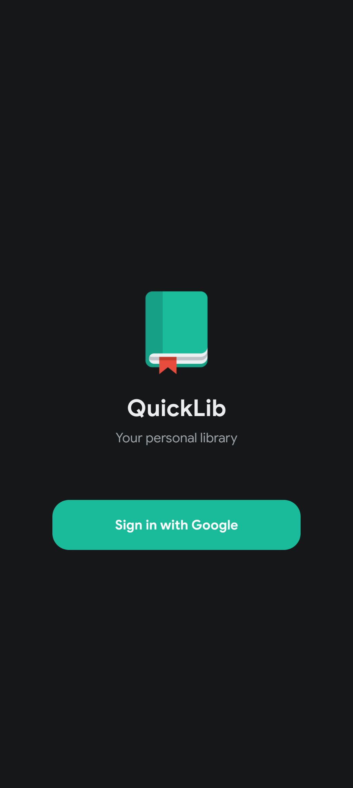
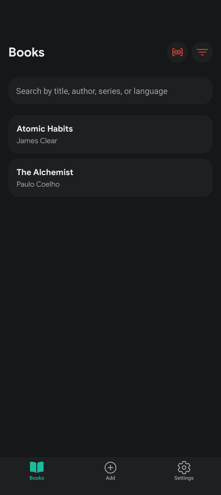
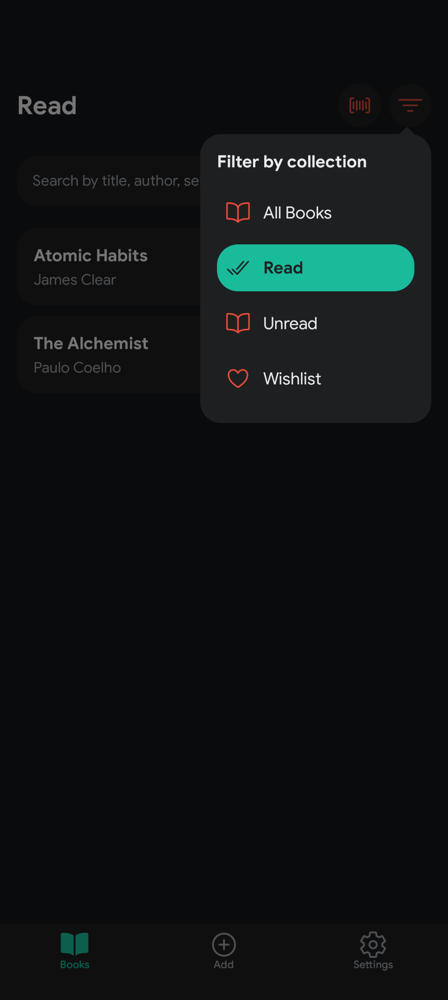
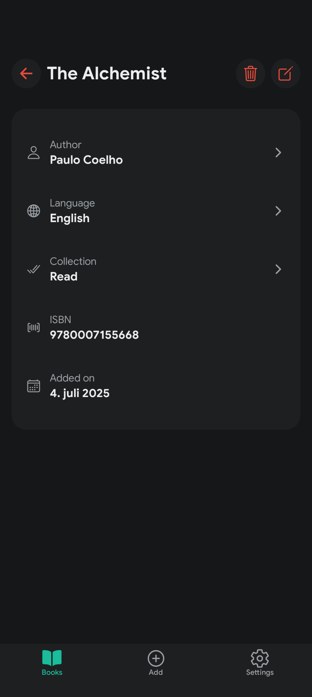
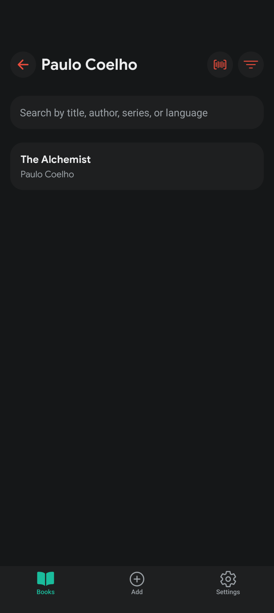
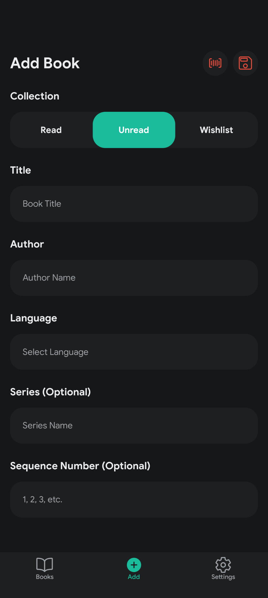
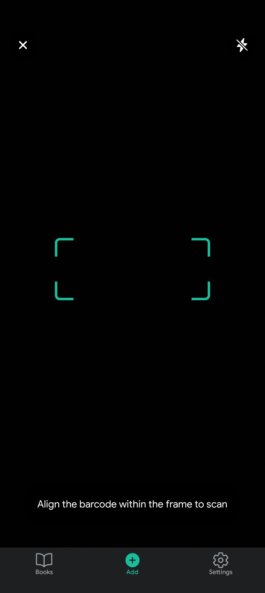
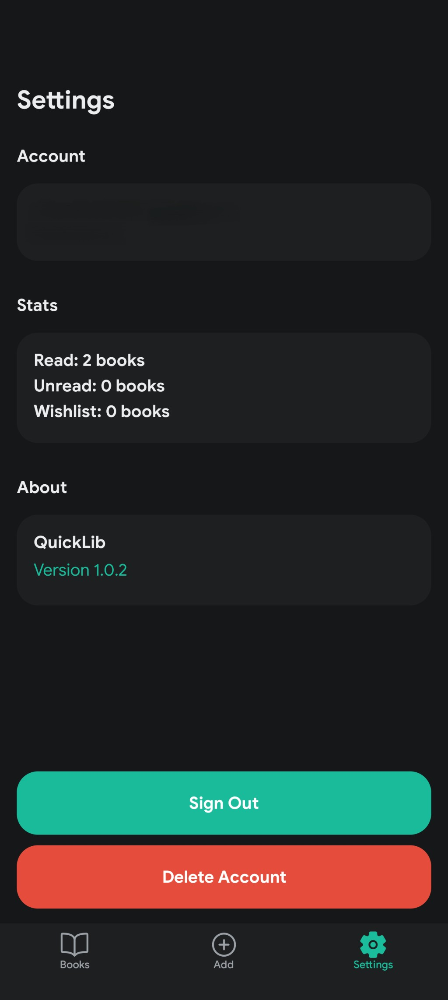

# QuickLib

QuickLib is a full-stack library management application with a Kotlin/Spring Boot backend and an Expo/React Native frontend.

## Features

- Sign in with Google 🔑
- Browse your book collection 📚
- Filter and organize your books 🎛️
- View detailed book information ℹ️
- Add new books to your library ➕
- Scan barcodes for quick entry 📸

## Getting Started

### Project Structure

- [`backend/quicklib/`](backend/quicklib/) - Kotlin/Spring Boot backend API
- [`frontend/quicklib/`](frontend/quicklib/) - Expo/React Native frontend app

### Releases

The backend application is published as a Docker image on the GitHub Container Registry at [ghrc.io/aimarchirico/quicklib](https://ghcr.io/aimarchirico/quicklib).

The frontend application is available for download on [Android](https://github.com/aimarchirico/quicklib/releases) or as a web application on [quicklib.chirico.no](https://quicklib.chirico.no). 

### Local Development

1. Clone the repository.
2. See the `README.md` files in the [`backend/quicklib/`](backend/quicklib/) and [`frontend/quicklib/`](frontend/quicklib/) folders for setup instructions.

## Showcase

 
 
 

 
 

