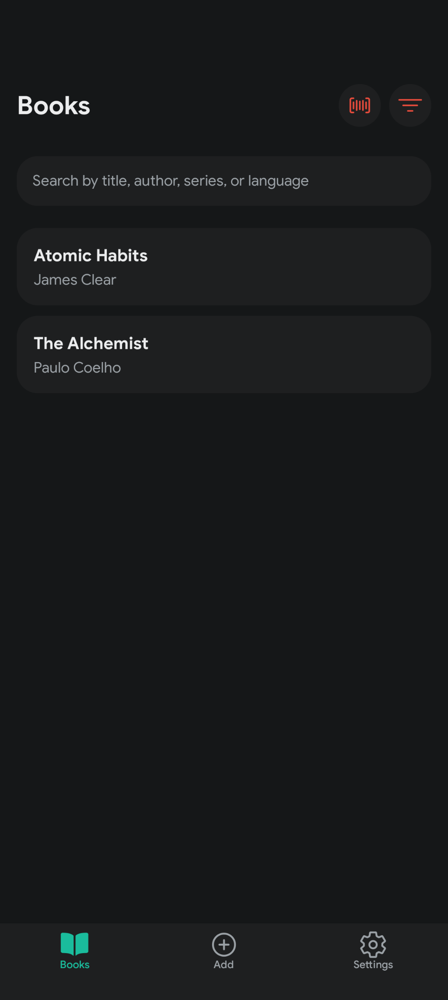
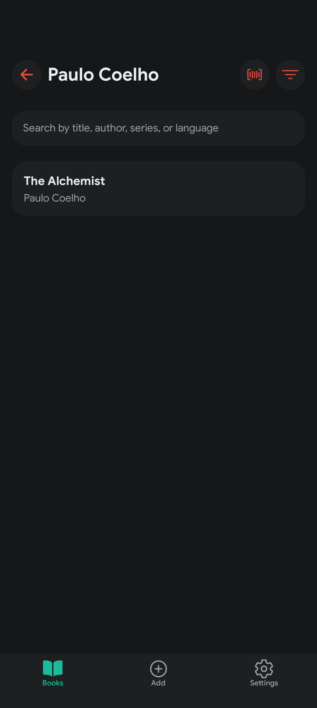

# QuickLib

QuickLib is a full-stack library management application with a Kotlin/Spring Boot backend and an Expo/React Native frontend.

 
 
 

 
 

# Features

- Sign in with Google 🔑
- Browse your book collection 📚
- Filter and organize your books 🎛️
- View detailed book information ℹ️
- Add new books to your library ➕
- Scan barcodes for quick entry 📸

## Project Structure

- `[backend/quicklib/](backend/quicklib/)` - Kotlin/Spring Boot backend API
- `[frontend/quicklib/](frontend/quicklib/)` - Expo/React Native frontend app

## Getting Started

1. Clone the repository.
2. See the `README.md` files in the `[backend/quicklib/](backend/quicklib/)` and `[frontend/quicklib/](frontend/quicklib/)` folders for setup instructions.
